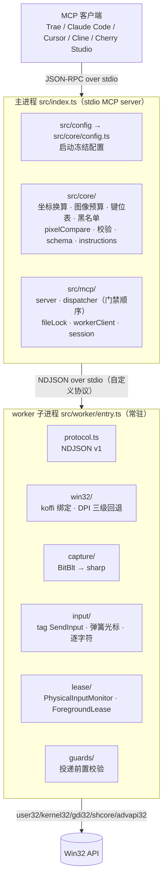
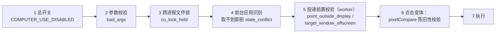
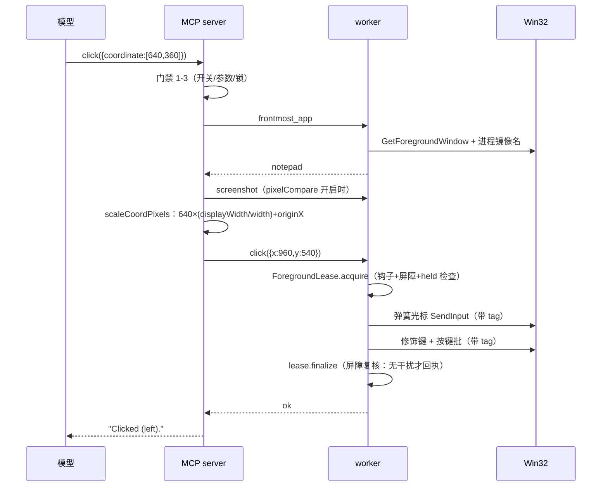

# 架构 / Architecture

> 面向维护者的分层说明。与 cc-haha 的逐项对应见 [PARITY.md](PARITY.md)。

## 总览



## 进程结构

**主进程**（MCP server）负责所有可纯 JS 测试的逻辑：MCP 协议、工具 schema 与分发、门禁顺序与参数校验、坐标换算、图像预算计算、键盘黑名单判定、文件锁、取消语义、持键台账、batch 编排、worker 生命周期。它只通过 worker 客户端触碰系统。

**worker 子进程**负责一切必须 FFI 的部分：DPI 感知、显示器枚举、截图与图像编码、`SendInput` 注入、弹簧光标、逐字符输入、剪贴板读写、窗口/应用枚举与注册表、干扰检测、投递前置校验。

保留这条进程边界有三个理由（对应计划 §5.1）：

1. **崩溃隔离**：FFI 访问违例不应带走 MCP server。
2. **租约天然成立**：「一个动作 = 一个会话」的 `ForegroundLease` 边界与子进程边界重合。
3. **互不干扰**：原生消息循环与 MCP 主事件循环隔开。

### worker 生命周期

| 阶段     | 行为                                                                                                                       |
| -------- | -------------------------------------------------------------------------------------------------------------------------- |
| 懒加载   | 首个需要 FFI 的工具调用才 spawn（没用电脑的会话不占进程、不装钩子）                                                        |
| 常驻     | spawn 后保持存活，多次调用复用                                                                                             |
| 空闲超时 | `COMPUTER_USE_WORKER_IDLE_MS`（默认 300s）无请求则退出，释放低级钩子                                                       |
| 联动关闭 | 主进程退出或 stdin EOF 时立即关闭 worker                                                                                   |
| 崩溃重启 | 非正常退出自动重启，在途动作用 `worker_crashed_result_unknown` 拒绝——「可能已发出，先截图」；60s 内崩溃超过 3 次则停止重启 |

## 消息泵（Phase 0 的关键发现）

cc-haha 用 Python daemon 线程跑 `GetMessageW` 消息泵装低级钩子。**koffi 的 JS 回调只能在 Node 主线程运行**（Phase 0 微试验 D3 实测：`CreateThread` 注册回调内的 `GetCurrentThreadId()` 返回主线程 ID），因此原生线程泵无法表达。本项目的适配：

```
主线程（worker 进程）
├── 事件循环 await 期间：libuv 泵 + 显式 PeekMessageW 排空 → 钩子回调内联执行
├── 屏障 = PostThreadMessageW(WM_APP_INPUT_BARRIER) 到自身线程 + 同步排空至取到该消息
│     （FIFO 保证先于它排队的输入事件已跑完回调）
└── 长阻塞（hold 时长 / 逐字符 / 弹簧帧）：25ms 分段 sleep + monitor.pump() 周期排空
      （否则 Windows 会超时丢弃钩子事件，物理输入漏检）
```

崩溃隔离仍在进程级（worker 是子进程）；干扰检测——Windows 侧最有价值的机制——完整保留。

## 门禁顺序（每次调用）



黑名单检查（`press_key`/`hold_key`/点击修饰键）排在门禁**之前**：被拦截的组合即使前台不可识别，也应返回 `grant_flag_required` 而不是前台错误——模型的修复动作是申请授权位，不是切换焦点。

## 数据流：一次点击



## 源码地图

| 目录             | 内容                                                                                                                          | 可测性                               |
| ---------------- | ----------------------------------------------------------------------------------------------------------------------------- | ------------------------------------ |
| `src/core/`      | 纯逻辑：错误码、配置冻结、坐标换算、图像预算、键位表、黑名单、pixelCompare、校验、显示器标签、分字、工具 schema、instructions | 单元测试全覆盖，无 FFI               |
| `src/mcp/`       | MCP 服务器、分发与门禁、文件锁、worker 客户端、会话状态与持键台账                                                             | 桩 worker 覆盖全部分支               |
| `src/worker/`    | FFI 栈：protocol、win32、capture、input、clipboard、windows、lease、guards、actions                                           | 契约测试 + live 冒烟 + 桌面测试      |
| `tools/poc/`     | Phase 0 硬门禁 POC（`hook-poc.mjs`）与调查探针                                                                                | 手动运行                             |
| `tools/smoke/`   | live 冒烟：worker 协议、MCP 服务器集成                                                                                        | `npm run smoke:worker` / `smoke:mcp` |
| `tests/desktop/` | 真实桌面测试（默认不跑）                                                                                                      | `COMPUTER_USE_DESKTOP_TESTS=1`       |

## 测试策略

| 层           | 位置              | 进 CI  | 内容                                                                      |
| ------------ | ----------------- | ------ | ------------------------------------------------------------------------- |
| 单元测试     | `tests/unit/`     | 是     | core 纯逻辑 + dispatcher 门禁分支 + worker 客户端生命周期                 |
| 契约测试     | `tests/contract/` | 是     | ① 工具 schema 快照（对 cc-haha 权威定义）② worker 协议编解码 ③ 错误码映射 |
| 真实桌面测试 | `tests/desktop/`  | **否** | 截图、光标、点击、输入、干扰检测、投递校验                                |
| live 冒烟    | `tools/smoke/`    | 手动   | 真实 worker、真实 MCP 客户端                                              |

快照契约测试防「静默偏离」：`scripts/extract-tool-snapshots.mjs` 从 cc-haha 的 `windowsLegacyTools.ts` 提取权威 schema，施加**唯一允许的变换**（`src/core/toolNames.ts` 的工具名映射）后入库；CI 断言实际工具列表与快照结构一致。任何差异都会让 CI 变红——偏离必须是被显式批准的。
